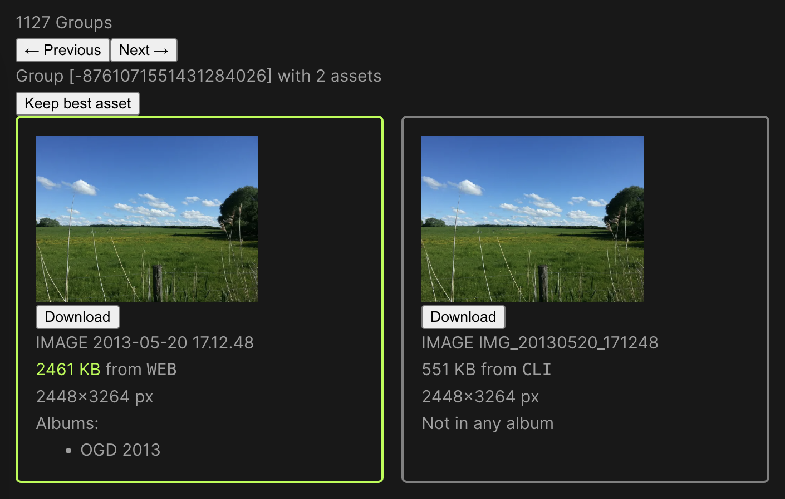

# immich-duplicates

Find image and video duplicates in Immich.

1. Install [findimagedupes](https://gitlab.com/opennota/findimagedupes).
   Alternatively, you may use docker as outlined in the next step.

1. Run `findimagedupes` against your Immich thumbnails directory scanning the
   large JPEG thumbnails.

   ```sh
   $ "$HOME/go/bin/findimagedupes" --prune \
                                   --fingerprints dupes.db \
                                   --prune \
                                   --no-compare \
                                   --exclude '\.webp$' \
                                   /path/to/immich/thumbs/<your user ID>
   ```

   Or, if you don't want to compile `findimagedupes` yourself:

   ```sh
   $ docker container run \
                      --rm \
                      --volume /path/to/immich/thumbs/:/thumbs/ \
                      --volume "$PWD:/output/" \
                      ghcr.io/agross/immich-duplicates-findimagedupes \
                      --prune \
                      --fingerprints /output/dupes.db \
                      --prune \
                      --no-compare \
                      --exclude '\.webp$' \
                      /thumbs/<your user ID>
   ```

1. The resulting `dupes.db` is a SQLite database. Group the duplicates as a
   JSON document using the provided Ruby script.

   The grouper currently only supports exact matches by perceptive hash.

   ```sh
   $ docker container run \
                      --rm \
                      --volume /path/containing/dupes.db/:/app/data/ \
                      ghcr.io/agross/immich-duplicates-grouper
   42 duplicate groups
   ```

   In `/path/containing/dupes.db/` you will now find a `dupes.json` file.
   Its contents will later be required to be pasted into the duplicate browser.

1. Configure the Immich server to accept API calls from foreign domains (CORS).

   Depending in your web server the setup will differ a bit.

   For nginx, add the following lines to the
   [`location` serving `/api`](https://github.com/immich-app/immich/blob/main/nginx/templates/default.conf.template#L61):

   ```conf
   if ($request_method = 'OPTIONS') {
     add_header 'Access-Control-Allow-Origin' '*';
     add_header 'Access-Control-Allow-Methods' 'GET, PUT, POST, DELETE, OPTIONS';
     add_header 'Access-Control-Allow-Headers' 'X-Api-Key, User-Agent, Content-Type';
     add_header 'Access-Control-Max-Age' 1728000; # 20 days
     add_header 'Content-Type' 'text/plain; charset=utf-8';
     add_header 'Content-Length' 0;
     return 204;
   }

   # This needs to be set in the location block.
   add_header 'Access-Control-Allow-Origin' '*' always;
   ```

   For Traefik, add the CORS middleware to the router serving Immich.

   ```conf
   traefik.http.routers.immich.middlewares=immich-cors

   traefik.http.middlewares.immich-cors.headers.accessControlAllowOriginList=*
   traefik.http.middlewares.immich-cors.headers.accessControlAllowMethods=GET, PUT, POST, DELETE, OPTIONS
   traefik.http.middlewares.immich-cors.headers.accessControlAllowHeaders=X-Api-Key, User-Agent, Content-Type
   traefik.http.middlewares.immich-cors.headers.accessControlMaxAge=1728000
   ```

1. Generate an API key for your account on the Immich web UI and save it.
1. Build and run the docker image for the duplicate browser.

   ```sh
   $ docker container run --rm --publish 8080:80 ghcr.io/agross/immich-duplicates-browser
   ```

1. Navigate to [http://localhost:8080](http://localhost:8080).
1. On the setup screen, paste your Immich data.

   * API endpoint URL, e.g. `https://immich.example.com/api`
   * API key generated above
   * The contents of the `dupes.json` file generated above

1. If everything works you should see something like this:

   

1. All data (API key, endpoint URL, duplicate groups) is stored locally in your
   browser.

   * If you follow the instructions above, duplicates will be determined by
     their downsized (but still large) JPEG thumbnail. Videos will also be
     considered, but only by their thumbnail image (= 1 frame of the video).
   * For each thumbnail a perceptive hash will be computed. Images with the same
     perceptive hash would be considered the same by the human eye. Currently
     hashes are compared using strict equality, there is no way to allow
     deviation from equality by e.g. by allowing the Hamming distance of two
     hash values to be `> 0`. I accept pull requests ;-)
   * The best duplicate (with the green border, displayed first) is determined
     by file size only. I accept pull requests!
   * If you click "Keep best asset" for the currently displayed group:
     * The best asset will be added to all albums of the group's other
       ("non-best") assets
     * The best asset will become a favorite if any asset in the group is a
       favorite
     * All "non-best" assets will be deleted
     * The group's information will be purged from your browser
   * If you ignore a duplicate group the group's information will be purged from
     your browser

## Recommended IDE Setup

[VSCode](https://code.visualstudio.com/) + [Volar](https://marketplace.visualstudio.com/items?itemName=Vue.volar) (and disable Vetur) + [TypeScript Vue Plugin (Volar)](https://marketplace.visualstudio.com/items?itemName=Vue.vscode-typescript-vue-plugin).

## Type Support for `.vue` Imports in TS

TypeScript cannot handle type information for `.vue` imports by default, so we replace the `tsc` CLI with `vue-tsc` for type checking. In editors, we need [TypeScript Vue Plugin (Volar)](https://marketplace.visualstudio.com/items?itemName=Vue.vscode-typescript-vue-plugin) to make the TypeScript language service aware of `.vue` types.

If the standalone TypeScript plugin doesn't feel fast enough to you, Volar has also implemented a [Take Over Mode](https://github.com/johnsoncodehk/volar/discussions/471#discussioncomment-1361669) that is more performant. You can enable it by the following steps:

1. Disable the built-in TypeScript Extension
    1) Run `Extensions: Show Built-in Extensions` from VSCode's command palette
    2) Find `TypeScript and JavaScript Language Features`, right click and select `Disable (Workspace)`
2. Reload the VSCode window by running `Developer: Reload Window` from the command palette.

## Customize configuration

See [Vite Configuration Reference](https://vitejs.dev/config/).

## Project Setup

```sh
npm install
```

### Compile and Hot-Reload for Development

```sh
npm run dev
```

### Type-Check, Compile and Minify for Production

```sh
npm run build
```

### Lint with [ESLint](https://eslint.org/)

```sh
npm run lint
```
